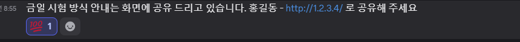

# 금일 시험 안내

## https://github.com/edumgt/investment-analysis 의 웹앱과 
## https://github.com/edumgt/domain-rag-lab 의 웹앱을 통합(하나로 합침)

## 해당 웹앱의 기능에서 본인 만의 금융, 경제 정보 웹앱으로 메뉴, 기능을 개편하고
## AWS Cloud 의 EC2 에 올려서 해당 EIP(탄력적 IP) 를 공유 합니다.

## 4시까지 작업 후 디스코드에 홍길동 - http://본인 사용 IP(예:1.2.3.4) 로 공유 합니다.
## 디스코드의 훈련생 올린 IP 에 접속하여, 각자 판단에 따라 100점 이모지를 붙여주시면, 해당 이미지콘의 갯수로 총점을 정해 시험점수로 반영 합니다.

## 4시까지의 작업이 원할히 진행되면, 람다, API GW 를 붙여보는 작업을 추가합니다.